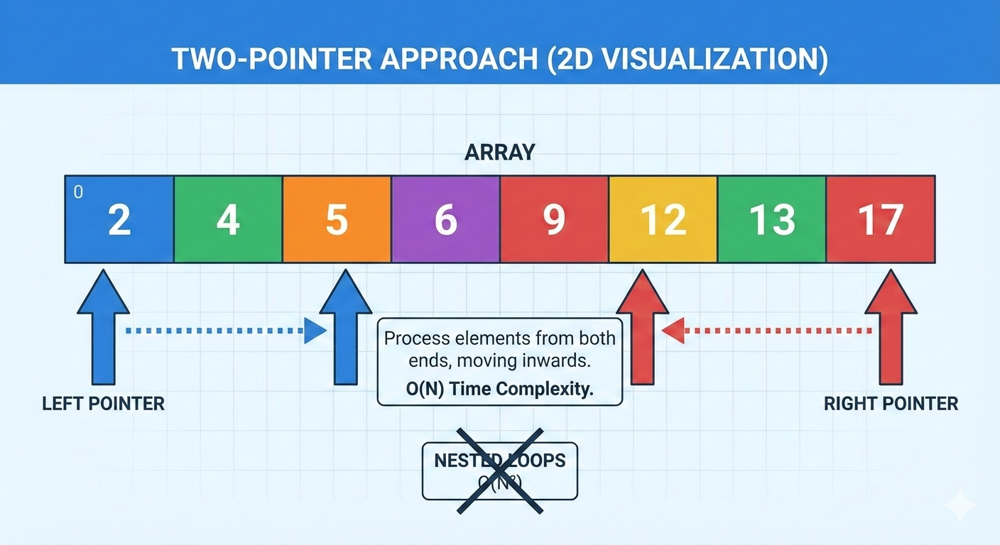

# Two Pointer Approach

## Definition

- Iterate over a data between two distinct reference points or pointer 
- It is commonly used in various algorithms.
- Used where we want to use two points.

## Example

Reverse an array
```
int arr[] = [1, 2, 3, 4]
```

Result = [4, 3, 2, 1]




## Steps
- Start at O and End at Size - 1 and Increment
- Swap the digits


## Conditions
- Consider odd and even size of arrays
- If Start pointer is greater than End pointer then Stop

## Usage
- Reverse
- Palindrome


